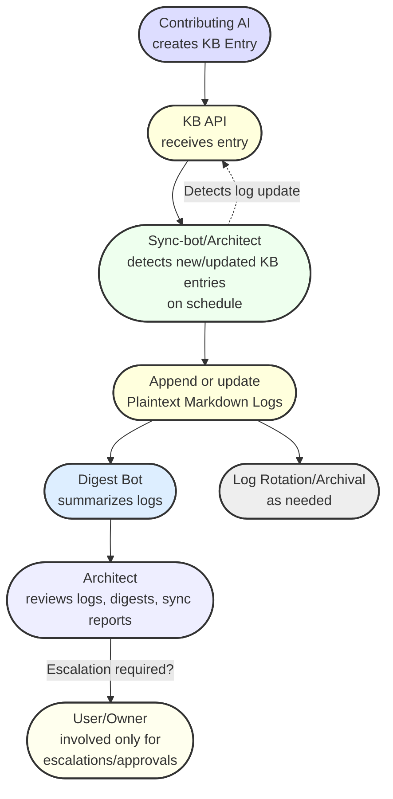

# NovaRay System — Operational Flowchart & Typical Workflow

_Last updated: 2025-06-19_

---

## 1. Operational Flowchart (Mermaid)



---

## 2. Step-by-Step Example: "Lunae Completes a Subtask"

### Scenario
- **Lunae** (Contributing AI) completes a subtask and wants to log the result.

#### Step 1: Lunae Creates a GeneralMessage
> Lunae generates a GeneralMessage:
> - type: "status_update"
> - content: "Subtask 42 completed, all tests green"
> - confidence_weight: 1.0
> - timestamp: 2025-06-19T19:10:00Z

#### Step 2: KB API Receives Entry
> Lunae submits this message to the KB API.  
> KB API validates and stores the entry.

#### Step 3: Sync-bot Detects Update
> Within 1-5 minutes, the Sync-bot’s scheduled process notices the new KB API entry.

#### Step 4: Plaintext Markdown Log is Updated
> Sync-bot writes an entry to `KB_MESSAGES.md`:
> ```
> [2025-06-19T19:10:00Z] (Lunae, confidence_weight: 1.0): Subtask 42 completed, all tests green
> ```

#### Step 5: Digest Bot Summarizes (optional)
> If enabled, Digest Bot summarizes the last N entries, creating/adding to `KB_DIGESTS.md`:
> ```
> [Digest, 2025-06-19T19:15:00Z]: Subtask 42 completed by Lunae; all tests passed.
> ```

#### Step 6: Architect Reviews as Needed
> Architect reviews digests, full logs, and sync reports for anomalies, escalation needs, or trends.

#### Step 7: Log Archival (as needed)
> If `KB_MESSAGES.md` exceeds thresholds, Architect triggers rotation/archival.

#### Step 8: Escalation (if critical)
> If Lunae’s entry flagged a critical issue (e.g., failed tests or security concern),  
> Architect would prepare an escalation item for the User/Owner’s review.

---

## 3. Notes

- **Sync-bot/Architect** exclusively manages file writes for logs, ensuring security and traceability.
- **Digest Bot** helps both simple LLMs and the Architect quickly review history.
- **User/Owner** is only involved for escalations, strategic reviews, or unresolved sync/documentation conflicts.
- **All actions are logged and can be traced from KB API to plaintext, to digests, and to escalation/merge proposals.**

---

_This file is intended for onboarding, review, and operational guidance for all NovaRay system agents and contributors._